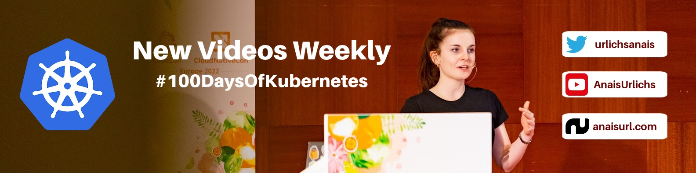

### Welcome to my GitHub 👋

   

**More about me?** ℹ️
* Developer Advocate at [Aqua Security](https://github.com/aquasecurity)
* Spent 3 years in crypto, contributing to [NEAR Protocol](https://github.com/near)
* View my [Website](https://anaisurl.com/)
* Checkout my DevOps [Newsletter](https://anaisurl.com/tag/devops)
* Subscribe to my [YouTube](https://www.youtube.com/c/AnaisUrlichs) for new tutorials weekly

I keep a list of public DevOps resources on my [Notion](https://devops.anaisurl.com/) :boom:

**Weekly Newsletter: Seven-Day DevOps**
<!-- NEWSLETTER-LIST:START -->
<!-- NEWSLETTER-LIST:END -->

**Interested in video tutorials? Follow me on my 100 Days of Kubernetes journey**
<!-- YOUTUBE-LIST:START -->
- [She Can Cloud Native: Kubernetes deployment strategies](https://www.youtube.com/watch?v=r1GRGLsblF4)
- [She Can Cloud Native: Kubernetes 101 - What I wish I knew as a Developer](https://www.youtube.com/watch?v=3mNxtNqGk78)
- [She Can Cloud Native: Cloud Native WebAssembly with Divya Mohan](https://www.youtube.com/watch?v=QvIoE_M_GHA)
- [State Of OpenCon 2023 - Learning the ropes of open source contributions](https://www.youtube.com/watch?v=CuMW4zIqssY)
- [Live Stream on Cloud Native Design Icons -- on the Aqua OS Channel](https://www.youtube.com/watch?v=bJ-XuFB1HC0)
<!-- YOUTUBE-LIST:END -->
